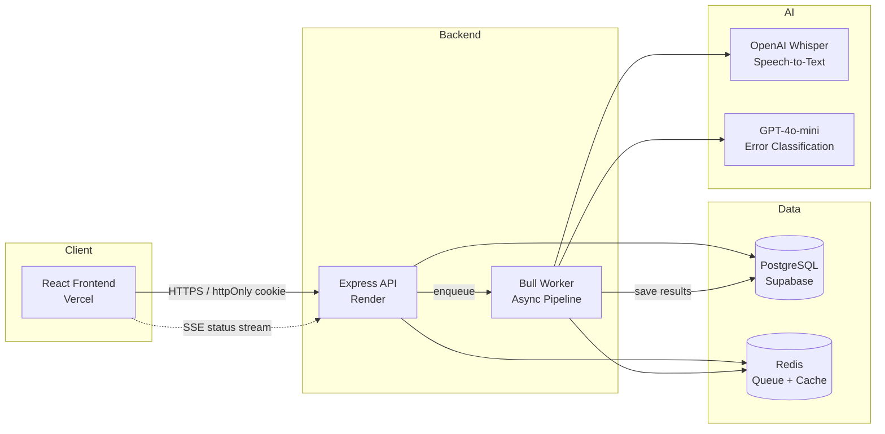

# Decodex — AI-Powered Reading Screening & Assessment Platform for Dyslexia Education


Decodex captures students reading aloud, transcribes via Whisper, aligns against source text with Needleman-Wunsch DP, classifies error patterns using Orton-Gillingham taxonomy (GPT-4o-mini), generates personalised practice drills, and gives teachers and parents actionable reading analytics with human-in-the-loop override capability.

> **Educational screening tool — not a clinical assessment.**
> Decodex is a reading screening and practice tool for educational use. It does **not** provide a clinical or medical diagnosis of dyslexia or any other condition. For formal assessment, consult a qualified speech-language pathologist or educational psychologist.

---

## Live Demo

| Component | URL |
|-----------|-----|
| **Frontend** | [decodex-five.vercel.app](https://decodex-five.vercel.app/) |
| **Backend Health** | [decodex-backend.onrender.com/health](https://decodex-backend.onrender.com/health) |

This is a fully deployed full-stack application. The frontend is served by Vercel, the backend runs on Render, and the database is hosted on Supabase.

**Test accounts:** `student@decodex.com` / `teacher@decodex.com` / `parent@decodex.com` — password `password123`

---

## Architecture



**Audio processing flow:** Student records → audio uploaded to Express → job enqueued in Redis/Bull → worker transcribes (Whisper) → aligns transcript to source (Needleman-Wunsch) → classifies error patterns (GPT-4o-mini with O-G taxonomy prompt) → saves results → generates drills → pushes status via SSE to frontend.

---

## Tech Stack

| Technology | Version | Purpose |
|------------|---------|---------|
| **React** | 19 | Fast SPA with concurrent rendering |
| **Vite** | 8 | Dev server with HMR; production bundler |
| **TypeScript** | 6 (frontend) / 5 (backend) | End-to-end type safety |
| **Tailwind CSS** | 4 | Utility-first styling with a custom Decodex design system |
| **React Router** | 7 | Client-side routing |
| **Recharts** | 3 | Data visualisation for teacher dashboards (WPM trends, error breakdowns) |
| **Express** | 5 | Lightweight HTTP framework with native async/await route handlers |
| **PostgreSQL** | 14+ | Relational store for users, sessions, error classifications, drills, and consent records |
| **Redis + Bull** | — | Job queue for async audio processing — decouples transcription and classification from the request cycle |
| **OpenAI Whisper** | `whisper-1` | Speech-to-text transcription of student reading recordings |
| **GPT-4o-mini** | — | Error pattern classification with strict Orton-Gillingham taxonomy prompts (JSON mode) |
| **Opossum** | 10 | Circuit breaker around all OpenAI calls — degrades gracefully to a rule-based fallback |
| **Zod** | 4 | Runtime schema validation for API request bodies |
| **bcrypt** | 6 | Password hashing (cost factor 12) |
| **oxlint** | — | Fast linter for frontend TypeScript/TSX |

---

## Key Technical Decisions

### Circuit Breaker Pattern (Opossum)

All OpenAI API calls (Whisper and GPT-4o-mini) are wrapped in Opossum circuit breakers. When the provider is down or rate-limited, the circuit opens and the system falls back to a deterministic Orton-Gillingham rule engine. This prevents cascading failures and ensures students always receive results — even if classification quality is temporarily reduced. Errors classified during fallback are tagged as `UNC` (Uncertain) so teachers can review them.

### Consent-Gating Architecture

Because Decodex processes children's reading data, parental consent is required before any audio recording can occur. The system uses:
- **Invite codes** for in-app parent-student linking
- **Knowledge-based verification** (date of birth) with rate-limited attempts
- **Consent withdrawal** with a 30-day hard-delete grace period
- **Data erasure jobs** that purge session data when consent is withdrawn

The `requireConsent` middleware blocks the audio upload endpoint until a valid `parent_student_links` record with `consent_granted = TRUE` exists.

### Role-Based + Relationship-Verified Authorization

Beyond simple role checks (`student`, `teacher`, `parent`, `admin`), data access is scoped by verified relationships:
- **Students** can only access their own sessions, drills, and results (IDOR guards on every endpoint)
- **Teachers** can access student data only for students at the same school (`school_id` join)
- **Parents** can access data only for children linked via `parent_student_links`
- **Admins** bypass relationship checks entirely

---

## Data Storage — What We Actually Persist

> This section reflects the current state of `backend/src/db/schema.sql` and will be updated as the data model evolves.

| Data | Stored? | Location | Notes |
|------|---------|----------|-------|
| **Raw audio recording** | Yes — persisted in object storage | 
  `reading_sessions.audio_storage_key` (references object storage; local disk or Supabase Storage) | Audio is uploaded, stored in a private object storage bucket, and referenced by storage key, MIME type, and size. The legacy audio_base64 column has been removed (migration_v6). |
| **STT transcript** | Yes | `reading_sessions.transcript` | |
| **Alignment result** | Yes | `reading_sessions.alignment_result` (JSONB) | |
| **Error classifications** | Yes | `error_classifications` table | O-G category codes: REV, SUB, OMI, INS, BLD, PAC, UNC |
| **Error profiles** | Yes | `error_profiles` table | Aggregated per session |
| **Generated drills** | Yes | `drills` table (JSONB content) | |
| **User PII** | Yes | `users` table | email, display_name, date_of_birth, grade_level |
| **Consent records** | Yes | `parent_student_links`, `consent_tokens` | Includes consent timestamp and IP |
| **Audio in LLM prompts** | Never | — | Only anonymised alignment diffs sent to GPT-4o-mini — no audio, no student PII |

All tables include `deleted_at` for soft-delete support. Hard deletion runs 30 days after consent withdrawal.

---

## Local Development Setup

### Prerequisites

- Node.js 20+
- Docker (for PostgreSQL and Redis) or local PostgreSQL 14+ and Redis 6+

### 1. Start infrastructure

```bash
docker compose up -d   # Starts PostgreSQL (port 5432) and Redis (port 6379)
```

### 2. Backend

```bash
cd backend
cp .env.example .env
# Edit .env — set JWT_SECRET (min 32 chars), DATABASE_URL, OPENAI_API_KEY
npm install
npm run dev            # Starts on http://localhost:3000
```

### 3. Frontend

```bash
cd frontend
npm install
npm run dev            # Starts on http://localhost:5173, proxies /api to backend
```

### 4. Run tests

```bash
# Backend (vitest — 12 test files)
cd backend
npm test

# Frontend (vitest + Testing Library — 4 test files)
cd frontend
npm test
```

### Environment Variables

| Variable | Required | Description |
|----------|----------|-------------|
| `JWT_SECRET` | Yes | Random string >=32 chars. Generate with `openssl rand -base64 32` |
| `DATABASE_URL` | Yes | PostgreSQL connection string |
| `REDIS_URL` | Yes | Redis connection string |
| `OPENAI_API_KEY` | Yes | OpenAI API key for Whisper + GPT-4o-mini |
| `GROQ_API_KEY` | No | Alternative free-tier API key (Groq) |
| `FRONTEND_URL` | No | Frontend origin for CORS (defaults to `http://localhost:5173`) |
| `GMAIL_USER` | No | Gmail address for consent email delivery |
| `GMAIL_APP_PASSWORD` | No | Google App Password for email |

---

## CI Pipeline

Defined in `.github/workflows/ci.yml`. Runs on every push and pull request to `main`.

| Job | Steps |
|-----|-------|
| **Backend** (Node 20, ubuntu-latest) | `npm ci` -> `npm run build` (tsc) -> `npm test` (vitest) |
| **Frontend** (Node 20, ubuntu-latest) | `npm ci` -> `npm run lint` (oxlint) -> `npm run build` (vite) -> `npm test` (vitest) |

No live database is spun up in CI — backend tests mock or stub all DB calls.

---

## Security

- **Parameterised SQL queries** — all database access uses parameterised queries; no string interpolation of user input
- **bcrypt password hashing** — cost factor 12; no plaintext passwords stored
- **httpOnly cookie authentication** — JWT stored in httpOnly, Secure, SameSite=Strict cookie; no localStorage token storage
- **Rate limiting** — strict limits on auth endpoints; moderate global limit on all API routes
- **Relationship-verified data access** — students, teachers, and parents can only access data they have a verified relationship to
- **Consent gating** — audio recording is blocked until verifiable parental consent is on file
- **Error message masking** — internal error details are not exposed to clients in production
- **CORS allowlist** — only the deployed frontend origin is permitted
- **Helmet.js** — CSP, X-Frame-Options, X-Content-Type-Options, Referrer-Policy headers on all responses
- **OpenAI prompts contain no PII** — only anonymised passage text and alignment diffs are sent to the LLM

See [`documents/SECURITY_ANALYSIS.md`](documents/SECURITY_ANALYSIS.md) for the full threat model, STRIDE analysis, OWASP Top 10 mapping, and incident response plan.

---

## Project Structure

```
├── backend/
│   ├── src/
│   │   ├── routes/               # Express route handlers (17 files)
│   │   │   ├── auth.ts           # Login, register, logout
│   │   │   ├── sessions.ts       # Recording upload, pipeline trigger, results
│   │   │   ├── passages.ts       # Passage CRUD + AI generation
│   │   │   ├── consent.ts        # Parent consent flow
│   │   │   ├── teacher.ts        # Teacher dashboard data
│   │   │   ├── parentDashboard.ts
│   │   │   ├── analytics.ts
│   │   │   ├── learningPaths.ts  # 20-day adaptive learning path
│   │   │   ├── riskScreening.ts  # Dyslexia risk screening API
│   │   │   └── ...
│   │   ├── middleware/           # Auth, RBAC, consent, upload
│   │   ├── services/             # Business logic (16 files)
│   │   │   ├── alignment.ts      # Needleman-Wunsch word alignment
│   │   │   ├── classifier.ts     # O-G error classification (GPT-4o-mini)
│   │   │   ├── drills.ts         # Drill generation
│   │   │   ├── learningPath.ts   # Adaptive curriculum builder
│   │   │   ├── riskScreening.ts  # Risk computation + educational disclaimer
│   │   │   ├── dexTutor.ts       # AI tutor (Dex) service
│   │   │   ├── gamification.ts   # XP + streak logic
│   │   │   └── ...
│   │   ├── queue/                # Bull worker — full AI pipeline orchestration
│   │   ├── db/                   # schema.sql, seed data
│   │   └── __tests__/            # Backend test suite (vitest)
│   └── vitest.config.ts
├── frontend/
│   ├── src/
│   │   ├── pages/                # Route page components
│   │   ├── components/           # Shared UI components
│   │   ├── hooks/                # Custom hooks (SSE, API queries)
│   │   ├── lib/                  # API client (apiFetch), utilities
│   │   ├── context/              # AuthContext provider
│   │   └── __tests__/            # Frontend test suite (vitest + Testing Library)
│   └── vite.config.ts
├── documents/                    # PRD, TRD, frontend spec, security analysis, feature tickets
├── .github/workflows/            # CI pipeline (ci.yml)
└── docker-compose.yml            # Local dev infrastructure (PostgreSQL + Redis)
```

---

## Orton-Gillingham Error Taxonomy

Decodex classifies every misread word into one of seven categories from the Orton-Gillingham reading methodology:

| Code | Category | Description |
|------|----------|-------------|
| `REV` | Reversal | Letter or word reversal (e.g. "b" -> "d", "was" -> "saw") |
| `SUB` | Substitution | A different word substituted for the source word |
| `OMI` | Omission | Word skipped entirely |
| `INS` | Insertion | Extra word inserted that is not in the source |
| `BLD` | Blend breakdown | Multi-letter blend or digraph misread |
| `PAC` | Pacing / self-correction | Hesitation, repetition, or self-correction noted |
| `UNC` | Uncertain | Classification uncertain — LLM confidence too low, or circuit-breaker fallback active |

Teachers can override any classification via the human-in-the-loop correction UI. Overrides are stored in `classification_corrections` and feed into future analytics.

---

## License

ISC
